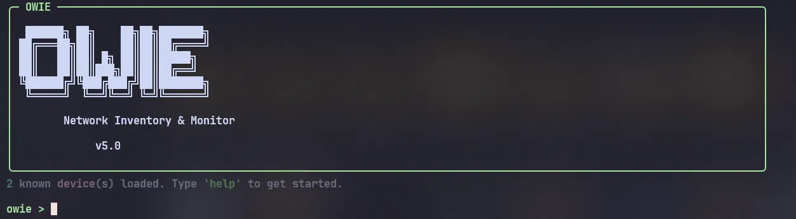
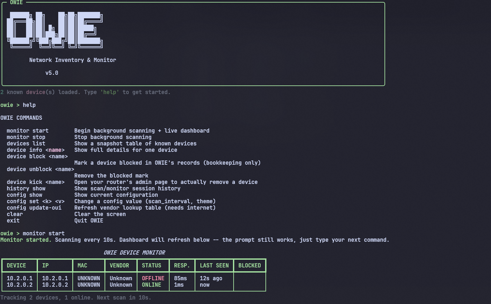

# OWIE



### About

OWIE is a clean cybersecurity/admin terminal network monitoring dashboard for people who want to know what's going on in their network. OWIE discovers the devices connected to your network, tracks them over time, and gives you a live terminal dashboard to keep an eye on who's online.



### Features

- Live terminal dashboard (Rich-based)
- Network device discovery (ping sweep + ARP table)
- MAC address and vendor detection
- JSON device history (persists across restarts)
- Background monitoring on a configurable interval
- Device blocklist + router admin-page shortcut
- More...

### Project Overview

```txt
OWIE_NEW/
├── main.py
├── requirements.txt
├── core/
│   ├── __init__.py
│   ├── config.py          # config.json load/save with validation
│   ├── database.py        # JSON device store, upsert-not-duplicate, atomic writes
│   ├── gateway.py         # detects your router's IP, cross-platform
│   ├── monitor.py         # background thread lifecycle (start/stop)
│   ├── scanner.py         # ping sweep, ARP-table MAC lookup, hostname resolution
│   └── vendor_lookup.py   # offline OUI table + optional online update
└── ui/
    ├── __init__.py
    ├── banner.py           # OWIE ASCII art
    ├── commands.py         # command parser + dispatch
    └── dashboard.py        # Rich tables + Live region
```

### Commands

- `monitor start`  
  Begin background scanning and discover nearby devices.

- `monitor stop`  
  Stop the active background scanning process.

- `devices list`  
  Show a table of known devices and basic information.

- `device info <name>`  
  Show detailed information about a specific device.

- `device block <name> [reason]`  
  Mark a device as blocked in OWIE's own records, with an optional note. This is bookkeeping only — it does not affect network access. Pair it with `device kick` below to actually remove a device.

- `device unblock <name>`  
  Remove the blocked mark from a device.

- `device kick <name>`  
  Opens your router's admin page in your browser and shows you the target device's IP/MAC, so you can block it from there — then marks it as blocked in OWIE's records automatically. This is the real removal step; see the note below.

- `history show`  
  Display previous scan and monitoring session history.

- `config show`  
  Show current OWIE configuration values.

- `config set <k> <v>`  
  Change a configuration setting.  
  Available: `scan_interval`, `theme`, `ping_timeout_ms`, `max_scan_threads`

- `config update-oui`  
  Refresh the vendor lookup database. Requires internet access.

- `clear`  
  Clear the terminal screen.

- `help`  
  Show available commands.

- `exit`  
  Quit OWIE.

### Quick start

Starting up OWIE is simple — you just need Python 3.10+ and pip. Install the one dependency and run it:

```bash
pip install -r requirements.txt
python3 main.py
```

`config.json` and `data/devices.json` are created automatically on first run.
